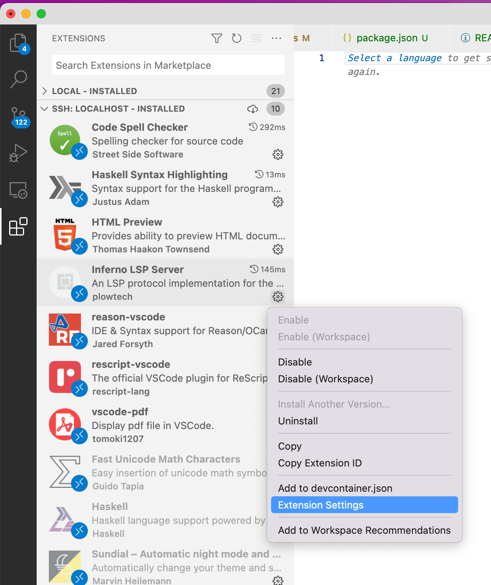

## vscode-inferno-lsp-server
This is a [Language Server Protocol](https://microsoft.github.io/language-server-protocol/) VSCode plugin for the Inferno scripting language.

# Installation

1. Inside this folder, run `nix-build .` to build the `.vsix` extension. Then, in VS Code, press `F1 > Extensions: Install from VSIX...` and navigate to the `result/` folder where nix placed the `vscode-inferno-lsp-server-*.vsix` file.

2. Navigate to the `inferno-lsp` folder in `all/inferno` and in a nix plow shell run `cabal build`. (optionally, move the generated `inferno-lsp-server` to your home folder)

3. In VS Code, navigate to the `Inferno LSP Server` extension settings 

4. Under `Vscode-inferno-lsp-server: Executable` pass in the path to the `inferno-lsp-server` binary compiled earlier